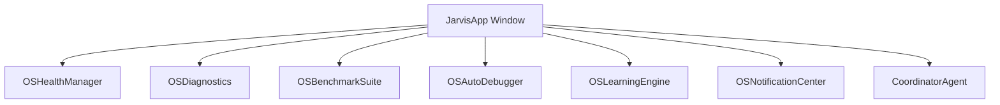

# Architecture Document: JARVIS v3.0

JARVIS is built as a modular Personal AI Operating System with integrated self-observability.

## Component Overview

## System Modules
1. **OSHealthManager**: Regularly inspects CPU, RAM, VRAM, and local server tags.
2. **OSDiagnostics**: Inspects package integrity and environment metrics.
3. **OSBenchmarkSuite**: Evaluates operation time history.
4. **OSAutoDebugger**: Traces, maps, and suggest fixes for exceptions.
5. **OSLearningEngine**: Keeps lightweight action success/failure stats.
